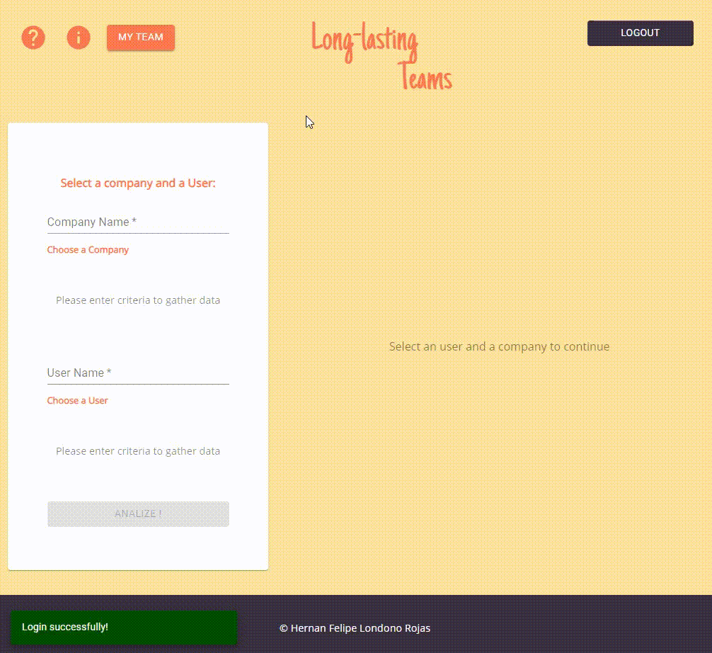

# How it was made
Based on the fact that Torre specializes in the identification of soft skills in addition to hard skills in the processes of searching for profiles for hiring, it was decided to make an application that, based on an artificial intelligence algorithm, allows to identify the match between the soft skills of each user registered as an applicant, and the soft skills of those people who have a long career in the contracting company, providing an estimate of the time that a certain applicant could be linked to the company, based on their interests and personal traits, and those that artificial intelligence recognizes in the base team (the process is measured in days, but the result is shown in months).

The endpoint was used to search the companies registered in Torre, the user search endpoint was used to find the profiles, the company endpoint was used to search the companies' employees, and later the information on the skills of each was searched.

The objective is to estimate or make a prediction of how long would an employee be in a company based on its personal traits. To achieve this, the process was as follows: the algorithm is trained with 50 profiles (on average) of people who have worked in the selected company, then the algorithm makes a prediction of how long a user would be in that company.

## Stack of Technologies
Frontend:
ReactJS 
Firebase

Backend:
NodeJS
TensorFlowJS

Deploy
Google Cloud Platform
Nginx

## Steps 
1.    Write the name of the company and the user.
2.   Pick one of the suggestions that will appear below
3.   Train the AI algorithm (up to 50 members of the company will be evaluated against the personal traits of the user profile chosen)"
4.   Compare the time the user will probably be in a company against other companies and choose one that will most fit you!
